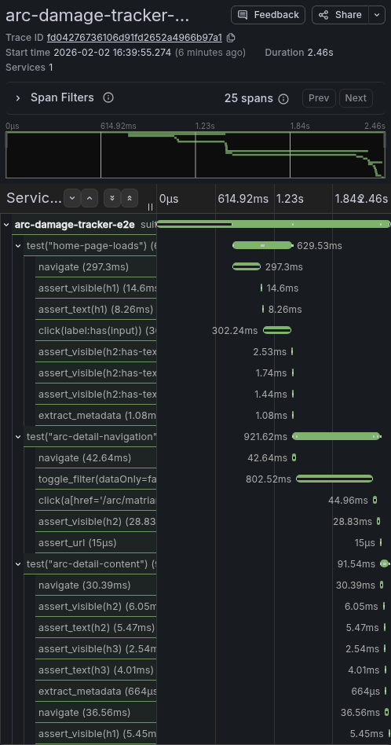

# smokeshow

OpenTelemetry instrumentation for Playwright E2E tests. One trace per suite run, with a three-level span hierarchy that gives you full observability into test behavior, timing, and reliability using the same Grafana stack you'd use for production services.

## Install

```bash
pip install smokeshow
```

Or from source:

```bash
pip install git+https://github.com/gotoplanb/smokeshow.git
```

## Quick start

```python
import asyncio
from smokeshow import InstrumentedBrowser

async def run():
    async with InstrumentedBrowser(
        service_name="my-app-e2e",
        suite_name="smoke-tests",
        base_url="http://localhost:8080",
        otlp_endpoint="http://localhost:4317",
    ) as browser:

        async with browser.test_case(name="home-page", case_id="TC-001") as test:
            await test.navigate("http://localhost:8080")
            await test.assert_visible("h1")
            await test.assert_text("h1", "Welcome")

    print(f"{browser.passed} passed, {browser.failed} failed")

asyncio.run(run())
```

This produces a single trace you can view in Jaeger or Grafana Tempo:

```
suite("smoke-tests")
  test("home-page")
    navigate(http://localhost:8080)
    assert_visible(h1)
    assert_text(h1)
```

## Trace structure

Every suite run produces one trace with three span levels:

| Level | Span name pattern | Example |
|-------|-------------------|---------|
| Suite (root) | `suite({name})` | `suite("smoke-tests")` |
| Test case | `test("{name}")` | `test("home-page")` |
| Action | `{type}({selector})` | `click(button#submit)` |

## Instrumented actions

The `test` object exposes these methods, each creating an action span:

| Method | Span name | What it wraps |
|--------|-----------|---------------|
| `navigate(url)` | `navigate` | `page.goto()` + performance timing |
| `click(selector)` | `click({selector})` | `page.click()` |
| `fill(selector, value, sensitive=False)` | `fill({selector})` | `page.fill()` with optional redaction |
| `assert_visible(selector)` | `assert_visible({selector})` | `page.wait_for_selector(state="visible")` |
| `assert_text(selector, expected)` | `assert_text({selector})` | Element text contains expected (case-insensitive) |
| `assert_count(selector, count)` | `assert_count({selector})` | Count of matching elements |
| `assert_url(pattern)` | `assert_url` | Current URL contains pattern |

### Navigation performance

`navigate()` automatically captures browser performance timing on each action span:

- `test.navigation.response_status` — HTTP status code
- `test.navigation.dom_content_loaded_ms` — Time to DOMContentLoaded
- `test.navigation.dom_interactive_ms` — Time to DOM interactive
- `test.navigation.load_event_ms` — Time to load event
- `test.navigation.transfer_size_bytes` — Page transfer size

### Sensitive data redaction

`fill()` auto-redacts values for selectors matching `password`, `card`, `cvv`, `ssn`, `credit`, `secret`, or `token`. You can also force redaction:

```python
await test.fill("input#card-number", "4111111111111111")        # auto-redacted
await test.fill("input#promo-code", "SECRET50", sensitive=True)  # explicit redaction
```

The span attribute `test.action.input_value` will show `[REDACTED]` instead of the actual value.

## Escape hatches

For actions not covered by the instrumented API, use the raw Playwright `Page`:

```python
async with browser.test_case(name="custom-test", case_id="TC-002") as test:
    await test.navigate("http://localhost:8080")

    # Raw Playwright page access (not instrumented)
    await test.page.evaluate("document.querySelector('[x-data]')._x_dataStack[0].flag = true")
    await test.page.wait_for_timeout(300)
```

For custom instrumented blocks, use `action_span()`:

```python
with test.action_span("extract_metadata") as span:
    count = await test.page.evaluate("document.querySelectorAll('.item').length")
    test.set_attribute("app.item_count", count)
    span.set_status(StatusCode.OK)
```

## Domain-specific attributes

Use `test.set_attribute()` to attach custom metadata to the test case span:

```python
async with browser.test_case(name="product-list", case_id="TC-003") as test:
    await test.navigate("http://localhost:8080/products")
    count = await test.page.evaluate("document.querySelectorAll('.product').length")
    test.set_attribute("app.product_count", count)
```

These attributes show up on the test case span in your trace backend, letting you track business metrics across test runs.

## Span attributes reference

### Suite span

| Attribute | Type | Description |
|-----------|------|-------------|
| `test.suite.name` | string | Suite name |
| `test.suite.id` | string | UUID for this run |
| `test.suite.total_tests` | int | Total test count (set at end) |
| `test.suite.passed` | int | Passed count (set at end) |
| `test.suite.failed` | int | Failed count (set at end) |
| `test.suite.result` | string | `passed`, `failed`, or `partial` |
| `test.run.trigger` | string | `manual`, `ci`, `scheduled` |
| `test.run.timestamp` | string | ISO 8601 start time |
| `test.target.base_url` | string | Base URL of app under test |
| `test.target.environment` | string | `development`, `staging`, etc. |
| `test.browser.name` | string | `chromium`, `firefox`, `webkit` |
| `test.browser.headless` | bool | Whether browser ran headless |
| `test.viewport.width` | int | Viewport width |
| `test.viewport.height` | int | Viewport height |
| `vcs.commit.sha` | string | Git commit SHA (auto-detected) |
| `vcs.branch` | string | Git branch (auto-detected) |

### Test case span

| Attribute | Type | Description |
|-----------|------|-------------|
| `test.case.name` | string | Test name |
| `test.case.id` | string | Stable identifier across runs |
| `test.case.tags` | string | Comma-separated tags |
| `test.case.description` | string | Longer description |
| `test.case.result` | string | `passed` or `failed` |
| `test.case.failure_reason` | string | Error message (on failure) |
| `test.case.failure_url` | string | Page URL at moment of failure |

### Action span

| Attribute | Type | Description |
|-----------|------|-------------|
| `test.action.type` | string | `navigate`, `click`, `fill`, etc. |
| `test.action.selector` | string | CSS selector used |
| `test.action.page_url` | string | Current page URL |
| `test.action.result` | string | `success` or `failed` |
| `test.action.input_value` | string | Fill value (or `[REDACTED]`) |
| `test.action.target_url` | string | URL for navigate actions |

## Configuration

Constructor arguments take precedence over environment variables:

| Constructor arg | Env var | Default |
|-----------------|---------|---------|
| `service_name` | `OTEL_SERVICE_NAME` | `playwright-otel` |
| `otlp_endpoint` | `OTEL_EXPORTER_OTLP_ENDPOINT` | `http://localhost:4317` |
| `environment` | `PLAYWRIGHT_OTEL_ENVIRONMENT` | `development` |
| `trigger` | `PLAYWRIGHT_OTEL_TRIGGER` | `manual` |
| `browser_type` | `PLAYWRIGHT_OTEL_BROWSER` | `chromium` |
| `headless` | `PLAYWRIGHT_OTEL_HEADLESS` | `true` |

## Infrastructure

Smokeshow exports traces via OTLP gRPC. You need a collector running to receive them. A typical local setup uses [Grafana Alloy](https://grafana.com/docs/alloy/) in Docker Desktop, forwarding traces to Tempo (or Jaeger) for visualization.

Smokeshow handles everything up to and including OTLP export. Collector and backend configuration is up to you.

## Real-world example

[arc-damage-tracker](https://github.com/gotoplanb/arc-damage-tracker) uses smokeshow for its E2E smoke tests. The test file ([`tests/test_e2e_otel.py`](https://github.com/gotoplanb/arc-damage-tracker/blob/main/tests/test_e2e_otel.py)) demonstrates:

- Three test cases with the suite runner pattern
- Custom `action_span()` blocks for Alpine.js interactions
- Domain-specific attributes (`arc.home.*`, `arc.detail.*`)
- Raw `test.page` access for JavaScript evaluation

Here's what a suite run looks like in Jaeger:



The span tree for the same run:

```
suite("arc-damage-tracker-smoke")
  test("home-page-loads")
    navigate(http://localhost:8080/)
    assert_visible(h1)
    assert_text(h1)
    click(label:has(input))
    assert_visible(h2:has-text('Extreme'))
    assert_visible(h2:has-text('Critical'))
    assert_visible(h2:has-text('High'))
    extract_metadata
  test("arc-detail-navigation")
    navigate(http://localhost:8080/)
    toggle_filter(dataOnly=false)
    click(a[href='/arc/matriarch'])
    assert_visible(h2)
    assert_url
  test("arc-detail-content")
    navigate(http://localhost:8080/arc/matriarch)
    assert_visible(h2)
    assert_text(h2)
    assert_visible(h3)
    assert_text(h3)
    extract_metadata
    navigate(http://localhost:8080/)
    assert_visible(h1)
```

## Development

```bash
git clone https://github.com/gotoplanb/smokeshow.git
cd smokeshow
python -m venv .venv && source .venv/bin/activate
pip install -e ".[dev]"
pytest -v
```

## Roadmap

- **v0.1** (current): Traces with full span hierarchy, sensitive data redaction, navigation timing
- **v0.2**: Metrics (test duration histograms, pass/fail counters)
- **v0.2**: Structured logs via OTEL log bridge
- **v0.2**: pytest plugin for automatic test discovery and instrumentation
